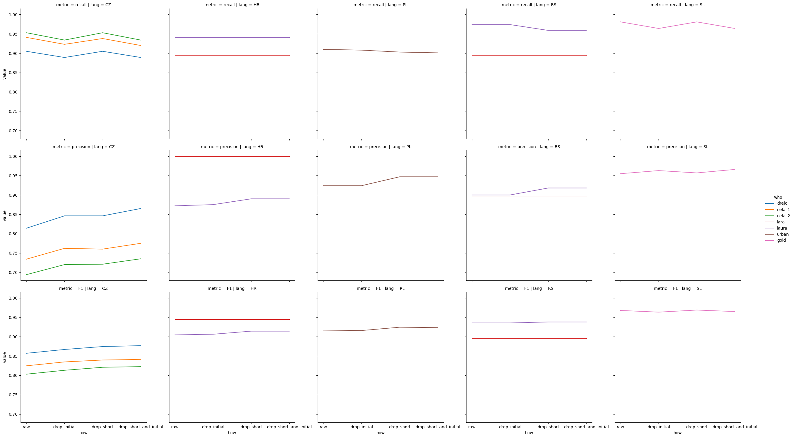

# Automated evaluation report

Report compiled: 2025-03-13T10:50:01.304588+01:00

## Composition of available files:

Simple count of available files per language and per annotator:

| lang   | who    |   file count |
|:-------|:-------|-------------:|
| SL     | gold   |          530 |
| RS     | laura  |          400 |
| CZ     | drejc  |          400 |
| CZ     | nela_2 |          400 |
| PL     | urban  |          400 |
| CZ     | nela_1 |          400 |
| HR     | laura  |          400 |
| RS     | lara   |           40 |
| HR     | lara   |           40 |
| PL     | peter  |            2 |

## Inter-annotator agreement

Displayed for all setups where it makes sense (at least two annotators.)

In case of three or more annotators, display pair-wise comparisons.

| lang   | who_1   | who_2   |   observed_agreement |   krippendorff_alpha |   common_files | precision       | recall          |
|:-------|:--------|:--------|---------------------:|---------------------:|---------------:|:----------------|:----------------|
| PL     | peter   | urban   |                1     |             1        |              2 | 1.0 <-> 1.0     | 1.0 <-> 1.0     |
| RS     | laura   | lara    |                0.909 |             0.814103 |             40 | 0.842 <-> 0.941 | 0.941 <-> 0.842 |
| CZ     | nela_2  | nela_1  |                0.907 |             0.813468 |            400 | 0.871 <-> 0.942 | 0.949 <-> 0.877 |
| HR     | laura   | lara    |                0.907 |             0.790607 |             40 | 0.872 <-> 1.0   | 1.0 <-> 0.872   |
| CZ     | drejc   | nela_1  |                0.854 |             0.706649 |            400 | 0.928 <-> 0.8   | 0.806 <-> 0.939 |
| CZ     | drejc   | nela_2  |                0.841 |             0.682    |            400 | 0.95 <-> 0.754  | 0.766 <-> 0.957 |

## Gender-based analysis:
The tables show results on `drop_short_and_initial`. For other post-processing methods, check out the plot below.

Overall:

| Speaker_gender   |   F1_score |
|:-----------------|-----------:|
|                  |      0.965 |
| M                |      0.877 |
| F                |      0.89  |

Per country:

| lang   | Speaker_gender   |   F1_score |
|:-------|:-----------------|-----------:|
| CZ     | F                |      0.851 |
| CZ     | M                |      0.829 |
| HR     | F                |      0.927 |
| HR     | M                |      0.908 |
| PL     | F                |      0.935 |
| PL     | M                |      0.913 |
| RS     | F                |      0.917 |
| RS     | M                |      0.956 |
| SL     |                  |      0.965 |

### A graphical representation of gender disparities for individual languages, annotators, and  postprocessing steps:

## Validation metrics:

| lang   | who    | how                    |   recall |   precision |       F1 |   num_files |
|:-------|:-------|:-----------------------|---------:|------------:|---------:|------------:|
| CZ     | drejc  | drop_short_and_initial |    0.889 |       0.865 | 0.876836 |         400 |
| CZ     | drejc  | drop_short             |    0.905 |       0.846 | 0.874506 |         400 |
| CZ     | drejc  | drop_initial           |    0.889 |       0.846 | 0.866967 |         400 |
| CZ     | drejc  | raw                    |    0.905 |       0.814 | 0.857091 |         400 |
| CZ     | nela_1 | drop_short_and_initial |    0.92  |       0.775 | 0.841298 |         400 |
| CZ     | nela_1 | drop_short             |    0.938 |       0.76  | 0.83967  |         400 |
| CZ     | nela_1 | drop_initial           |    0.923 |       0.762 | 0.834808 |         400 |
| CZ     | nela_1 | raw                    |    0.941 |       0.734 | 0.824709 |         400 |
| CZ     | nela_2 | drop_short_and_initial |    0.934 |       0.735 | 0.822636 |         400 |
| CZ     | nela_2 | drop_short             |    0.953 |       0.721 | 0.820924 |         400 |
| CZ     | nela_2 | drop_initial           |    0.934 |       0.72  | 0.813156 |         400 |
| CZ     | nela_2 | raw                    |    0.953 |       0.694 | 0.803135 |         400 |
| HR     | lara   | drop_initial           |    0.895 |       1     | 0.944591 |          40 |
| HR     | lara   | drop_short             |    0.895 |       1     | 0.944591 |          40 |
| HR     | lara   | drop_short_and_initial |    0.895 |       1     | 0.944591 |          40 |
| HR     | lara   | raw                    |    0.895 |       1     | 0.944591 |          40 |
| HR     | laura  | drop_short             |    0.94  |       0.89  | 0.914317 |         400 |
| HR     | laura  | drop_short_and_initial |    0.94  |       0.89  | 0.914317 |         400 |
| HR     | laura  | drop_initial           |    0.94  |       0.875 | 0.906336 |         400 |
| HR     | laura  | raw                    |    0.94  |       0.872 | 0.904724 |         400 |
| PL     | peter  | drop_initial           |    1     |       1     | 1        |           2 |
| PL     | peter  | drop_short             |    1     |       1     | 1        |           2 |
| PL     | peter  | drop_short_and_initial |    1     |       1     | 1        |           2 |
| PL     | peter  | raw                    |    1     |       1     | 1        |           2 |
| PL     | urban  | drop_short             |    0.903 |       0.947 | 0.924477 |         400 |
| PL     | urban  | drop_short_and_initial |    0.901 |       0.947 | 0.923427 |         400 |
| PL     | urban  | raw                    |    0.91  |       0.924 | 0.916947 |         400 |
| PL     | urban  | drop_initial           |    0.908 |       0.924 | 0.91593  |         400 |
| RS     | lara   | drop_initial           |    0.895 |       0.895 | 0.895    |          40 |
| RS     | lara   | drop_short             |    0.895 |       0.895 | 0.895    |          40 |
| RS     | lara   | drop_short_and_initial |    0.895 |       0.895 | 0.895    |          40 |
| RS     | lara   | raw                    |    0.895 |       0.895 | 0.895    |          40 |
| RS     | laura  | drop_short             |    0.959 |       0.918 | 0.938052 |         400 |
| RS     | laura  | drop_short_and_initial |    0.959 |       0.918 | 0.938052 |         400 |
| RS     | laura  | drop_initial           |    0.974 |       0.9   | 0.935539 |         400 |
| RS     | laura  | raw                    |    0.974 |       0.9   | 0.935539 |         400 |
| SL     | gold   | drop_short             |    0.981 |       0.957 | 0.968851 |         530 |
| SL     | gold   | raw                    |    0.981 |       0.955 | 0.967825 |         530 |
| SL     | gold   | drop_short_and_initial |    0.964 |       0.966 | 0.964999 |         530 |
| SL     | gold   | drop_initial           |    0.964 |       0.963 | 0.9635   |         530 |

### How do post-processing approaches affect the performance?

## Inspection of the biggest discrepancies

Methodology: Count _number_ of positive events in predictions and annotations.
Order by biggest difference. The TextGrids and audio are available on our
server at `/cache/peterr/filled_pause_validation/annotation_eval/TG`

| lang   | file                                        |   abs_diff |
|:-------|:--------------------------------------------|-----------:|
| PL     | itmex_S5yeg_17653.92-17670.2                |          4 |
| PL     | Bg6NIquuAdA_35077.78-35090.78               |          4 |
| PL     | YLNpUY4LJTQ_34936.16-34946.28               |          3 |
| PL     | TRS__RTSth8_10258.68-10272.18               |          3 |
| HR     | ParlaMint-HR_2017-07-05-0.u43379_3489-3630  |          3 |
| CZ     | 2022101815281542_470.52-480.92              |          3 |
| CZ     | 2022061510181032_206.52-222.18              |          3 |
| CZ     | 2022012613181332_256.23-271.19              |          3 |
| CZ     | 2020030415581612_281.38-288.52              |          3 |
| PL     | zDFyT-ZPVOU_5465.68-5483.0                  |          2 |
| PL     | wtewbJXL050_29282.42-29295.88               |          2 |
| PL     | oIrb0j4T5FQ_21417.84-21424.96               |          2 |
| PL     | kgOg9U0ua-4_4638.3-4655.4                   |          2 |
| PL     | hlGAABIlL0E_4386.6-4396.84                  |          2 |
| PL     | hFWBxjS8U2I_39461.06-39476.74               |          2 |
| PL     | XOWJ8vGHo7I_29392.46-29409.1                |          2 |
| RS     | ParlaMint-RS_2018-07-17-0.u41792_7388-7619  |          2 |
| RS     | ParlaMint-RS_2016-02-10-0.u49179_3709-3946  |          2 |
| RS     | ParlaMint-RS_2014-07-30-0.u5958_3535-3674   |          2 |
| RS     | ParlaMint-RS_2014-05-14-0.u1309_2608-2815   |          2 |
| RS     | ParlaMint-RS_2013-11-22-0.u28282_1317-1523  |          2 |
| RS     | ParlaMint-RS_2013-11-14-0.u27222_4445-4595  |          2 |
| RS     | ParlaMint-RS_2013-10-10-0.u24362_7293-7435  |          2 |
| HR     | ParlaMint-HR_2017-07-05-0.u43268_78-252     |          2 |
| HR     | ParlaMint-HR_2017-07-04-0.u42871_1254-1419  |          2 |
| HR     | ParlaMint-HR_2017-06-29-0.u42474_2564-2698  |          2 |
| HR     | ParlaMint-HR_2017-03-17-0.u33746_7661-7771  |          2 |
| HR     | ParlaMint-HR_2016-06-01-0.u10699_156-395    |          2 |
| SL     | Iriss-N-G5097-P600096-avd_224.921_254.688   |          2 |
| SL     | Iriss-J-Gvecg-P500028-avd_627.433_657.173   |          2 |
| SL     | Iriss-J-Gvecg-P500001-avd_2201.881_2231.331 |          2 |
| PL     | C3m7dED3BNg_14985.0-14997.6                 |          2 |
| PL     | AA3vHqu6iYk_28747.46-28755.2                |          2 |
| PL     | 3sjBHcXY-w8_15353.68-15370.68               |          2 |
| CZ     | 2022110117281742_455.23-471.66              |          2 |
| CZ     | 2022101208580912_507.46-524.34              |          2 |
| CZ     | 2022092715181532_217.04-231.94              |          2 |
| CZ     | 2022061415281542_188.70-195.46              |          2 |
| CZ     | 2022051312581312_622.31-634.12              |          2 |
| CZ     | 2022050420082022_565.36-579.73              |          2 |
| CZ     | 2022050311581212_223.57-232.49              |          2 |
| CZ     | 2022040515581612_99.00-106.29               |          2 |
| CZ     | 2022032918581912_236.43-249.13              |          2 |
| CZ     | 2022031113281342_335.85-348.25              |          2 |
| CZ     | 2020070716481702_470.26-485.06              |          2 |
| CZ     | 2020060409280942_310.76-329.52              |          2 |
| CZ     | 2020050518181832_677.79-684.86              |          2 |
| CZ     | 2020042819081922_295.29-306.82              |          2 |
| CZ     | 2020013112281242_124.92-134.81              |          2 |
| CZ     | 2014062009180932_268.02-284.40              |          2 |
| CZ     | 2014051314581512_102.16-114.72              |          2 |
| CZ     | 2014032610281042_361.00-377.77              |          2 |
| CZ     | 2014021119081922_520.16-535.18              |          2 |
| CZ     | 2014012215481602_466.41-483.03              |          2 |

## Manual analysis:

FP: false positive

FN: false negative

All comments based on auscultative examination

| lang   | file                           |   comment  |
|:-------|:-------------------------------|:-----------|
| CZ     | 2022101815281542_470.52-480.92 |          One FP by model, 2 likely FN by annotator |
| CZ     | 2022061510181032_206.52-222.18 |          One FP by model, 2 FN by annotator|
| CZ     | 2022012613181332_256.23-271.19 |          3 FN by annotator |
| CZ     | 2020030415581612_281.38-288.52 |          3 FN by annotator|
| PL     | 3sjBHcXY-w8_15353.68-15370.68  |          3:1 phenomenon |
| CZ     | 2022092715181532_217.04-231.94 |          twice 2:1 phenomenon |
| CZ     | 2022061415281542_188.70-195.46 |          2 FN by annotator |
| CZ     | 2022050420082022_565.36-579.73 |          One FP: prominent /aam/ perhaps lexical? One probably FN by annotator|
| CZ     | 2022032918581912_236.43-249.13 |          One probable FP by model, one probable FN by annotator |
| CZ     | 2022031113281342_335.85-348.25 |          Probable FN by annotator, one short FN by annotator|
| CZ     | 2020050518181832_677.79-684.86 |          2 consecutive FN by model at the beginning . Raw has them as one filled pause, but we cut it afterwards in post processing|
| CZ     | 2020013112281242_124.92-134.81 |          2 FN by model|
| CZ     | 2014032610281042_361.00-377.77 |          1 FN by model at 0.0 that we cut in post processing. 1 FN by model, detected by 1 annotator only |
| CZ     | 2014021119081922_520.16-535.18 |          1 debatable FP (/bih ə/) by model, one FN by one annotator|